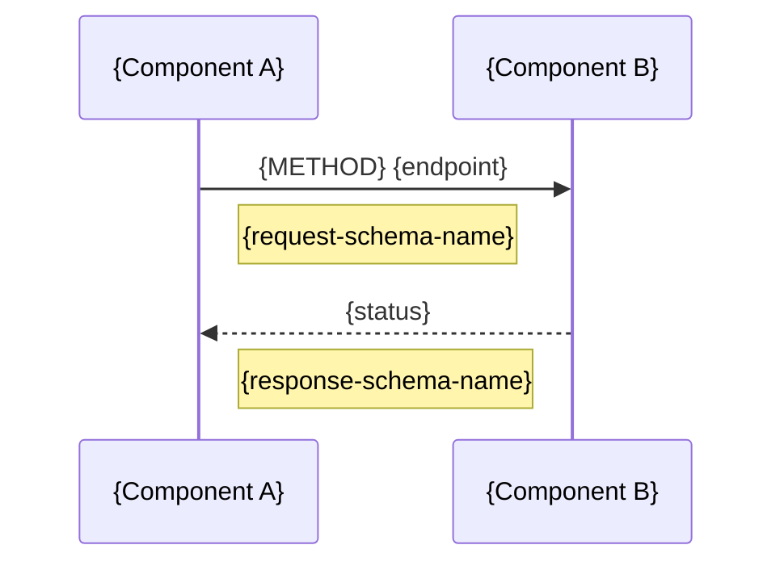
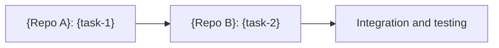

# {Feature Name} - Multi-Repository Flow

> Generated by `multirepo-plan` skill

## Repositories Involved

| Repo | Path | Role in this Feature |
|------|------|----------------------|
| {repo-a-name} | {path-a} | {producer/consumer/bidirectional} |
| {repo-b-name} | {path-b} | {producer/consumer/bidirectional} |

> Roles determined by analysis of exposed endpoints vs consumed APIs.

## Flow Diagram



## Communication Contracts

### `{METHOD} {path}`

| Aspect | Value |
|--------|-------|
| Content-Type | application/json |
| Auth | {Bearer/API Key/None} |
| Rate Limit | {if applicable} |

**Request Schema:**

```typescript
interface {RequestTypeName} {
  // request fields
}
```

**Response Schema:**

```typescript
interface {ResponseTypeName} {
  // response fields
}
```

**Status Codes:**

| Code | Meaning |
|------|---------|
| 200 | {success description} |
| 400 | {client error description} |
| 500 | {server error description} |

## Implementation Order



### Detailed Sequence

1. **{Repo A}**: {description of what must be implemented first}
2. **{Repo B}**: {description of what depends on previous step}
3. **Integration**: {how to validate both work together}

## Synchronization Notes

### Deploy

- {Recommended deploy order}
- {Feature flag considerations if applicable}

### Breaking Changes

- {List of changes that could break compatibility}
- {Migration strategy if applicable}

### Rollback

- {Procedure if something fails}
